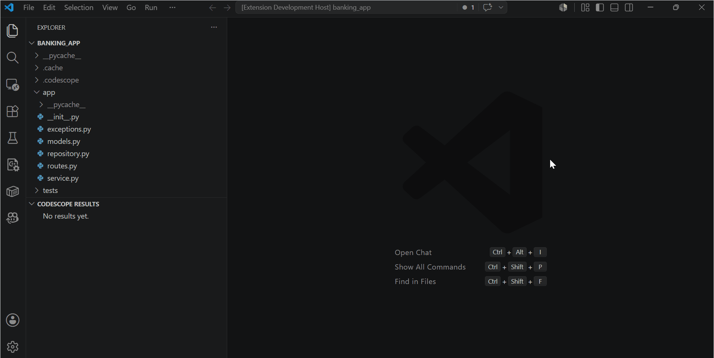

# CodeScope — AI-powered code search for failing Python tests

[](https://github.com/swarka7/CodeScope/actions/workflows/ci.yml)

CodeScope is a retrieval-first Python debugging tool that indexes a repository and helps developers find the source code most likely related to failing pytest tests or natural-language bug descriptions.

## Demo

Describe a bug in VS Code, get ranked relevant code, and jump directly to the function.



When a test fails or a bug is described in natural language, CodeScope helps answer:

> Which code should I inspect first?

CodeScope is not an automatic bug fixer and does not generate patches. It is also not a thin LLM wrapper. Its core is the retrieval and debugging-context layer: AST analysis, semantic indexing, dependency and call-path expansion, failure-aware ranking, description-aware investigation, deterministic reasons, JSON output, benchmarks, and optional LLM explanation over retrieved context.

## Why CodeScope Exists

- Failing tests usually show symptoms, not root causes.
- Large repositories make it hard to know where to start.
- LLMs can be useful, but they need focused and trustworthy context.
- CodeScope builds the retrieval layer first, before any optional LLM reasoning.

## Core Workflows

| Workflow | Command | Use case |
| --- | --- | --- |
| `search` | `python -m codescope.cli search <repo> "query"` | Find indexed code by intent or keyword query. |
| `diagnose` | `python -m codescope.cli diagnose <repo>` | Run pytest and rank likely relevant code for failing tests. |
| `investigate` | `python -m codescope.cli investigate <repo> "bug description"` | Describe a bug in natural language without running pytest. |
| `benchmark` | `python -m codescope.cli benchmark examples/realistic_bugs` | Evaluate whether CodeScope finds expected root-cause chunks in benchmark apps. |

`diagnose` uses pytest failure signals such as assertion messages, expected exceptions, traceback hints, and call paths.

`investigate` uses the user-provided bug description as the retrieval signal.

Both modes return likely relevant code to inspect. They do not prove the root cause, edit files, or generate fixes.

## Quick Demo

Example from the realistic banking benchmark:

```text
Failing test:
tests/test_transfers.py::test_successful_transfer_moves_money_and_records_activity

Likely relevant code:
1. TransferService.transfer
   Location: app/service.py:22-45
   Source: semantic
   reasons=
     - operation match: balance, record, transfer
     - business operation
     - state update logic
     - paired state operation

2. Account.credit
   Location: app/models.py:19-20
   Source: semantic
   reasons=
     - paired state operation
     - possible missing counterpart operation
```

The actual bug is that the transfer flow debits the sender but does not call `receiver.credit(amount)`. CodeScope ranks the business workflow first and surfaces the missing counterpart operation as useful context.

## Benchmark Results

PASS means the expected root-cause chunk appears in the top 3 likely relevant code results.
These are small realistic benchmarks, not proof of production readiness.

| benchmark | bug | expected root cause | observed rank | result |
| --- | --- | --- | --- | --- |
| `banking_app` | transfer debits sender but does not credit receiver | `TransferService.transfer` | rank 1 | PASS |
| `movie_platform` | combined search filters ignore genre | `MovieSearchService.search` | rank 1 | PASS |
| `inventory_app` | insufficient-stock shipment is allowed | `FulfillmentService.ship_order` | rank 3 | PASS |

Full benchmark report: [`docs/benchmark_results.md`](docs/benchmark_results.md).

External field evaluation notes: [`docs/field_evaluation.md`](docs/field_evaluation.md).

## Architecture

```text
Python repository
  ↓
Repo scanner
  ↓
AST parser
  ↓
Chunk extractor
  - functions
  - classes
  - methods
  - imports/dependencies
  ↓
Embedding text builder
  ↓
Local index
  - persistent JSON storage
  - incremental indexing
  - compatibility/version checks
  - atomic writes
  ↓
Retrieval engine
  - semantic search
  - dependency-aware expansion
  - static symbol resolution
  - call-path / reverse-call context
  ↓
User workflows
  ├─ search: free-form code search
  ├─ diagnose: pytest failure diagnosis
  └─ investigate: natural-language bug investigation
  ↓
Ranking + explanations
  - failure-aware ranking
  - description-aware ranking
  - ScoreBreakdown-backed reasons
  ↓
Outputs
  - human-readable CLI
  - JSON for tools/extensions
  - benchmark evaluator reports
  ↓
Optional LLM layer
  - redacted/capped context packet
  - fake provider for testing
  - optional OpenAI provider
  - no patches or file modifications
```

Deterministic retrieval is the source of truth. The optional LLM layer receives only bounded, redacted CodeScope context and is used for explanation, not ranking or repair. JSON output makes the same retrieval results consumable by future editor integrations and external tools.

## Technical Highlights

- AST chunking for functions, classes, methods, imports, dependencies, and decorators.
- Semantic embeddings for intent-based search.
- Persistent local indexes stored under `.codescope/`.
- Incremental indexing for unchanged files.
- Atomic index writes to reduce partial-index risk.
- Index compatibility and embedding-text version checks.
- Dependency-aware retrieval and multi-hop context expansion.
- Static symbol resolution for imports, aliases, relative imports, and same-class methods.
- Call-path and reverse-call context for validators, guards, callers, and business workflows.
- Failure-aware `diagnose` for pytest failures.
- Natural-language `investigate` for bug descriptions.
- ScoreBreakdown-backed explanations and deterministic retrieval reasons.
- JSON output for tools and future extensions.
- Benchmark evaluator for realistic bug examples.
- Optional fake and OpenAI LLM providers.
- Secret redaction and context-size caps before LLM prompts.
- GitHub Actions CI for tests and linting.

## Installation

Create and activate a virtual environment:

```bash
python -m venv .venv
```

Windows PowerShell:

```powershell
.venv\Scripts\Activate.ps1
```

Linux/macOS:

```bash
source .venv/bin/activate
```

Development install:

```bash
python -m pip install -e ".[dev,ai]"
```

Optional OpenAI provider support:

```bash
python -m pip install -e ".[openai]"
```

Combined development install with OpenAI support:

```bash
python -m pip install -e ".[dev,ai,openai]"
```

Normal CodeScope usage does not require OpenAI.

## Usage

Index a repository:

```bash
python -m codescope.cli index <repo>
```

Search indexed code:

```bash
python -m codescope.cli search <repo> "status transition validation"
```

Investigate a natural-language bug description:

```bash
python -m codescope.cli investigate <repo> "When I transfer money, the receiver balance does not increase"
```

Emit machine-readable investigate output:

```bash
python -m codescope.cli investigate <repo> "When I transfer money, the receiver balance does not increase" --json
```

Diagnose failing pytest tests:

```bash
python -m codescope.cli diagnose <repo>
```

Emit machine-readable diagnose output:

```bash
python -m codescope.cli diagnose <repo> --json
```

Run optional fake-provider LLM diagnosis:

```powershell
$env:CODESCOPE_LLM_PROVIDER="fake"
python -m codescope.cli diagnose examples/realistic_bugs/banking_app --llm
Remove-Item Env:CODESCOPE_LLM_PROVIDER
```

Run optional fake-provider LLM investigation:

```powershell
$env:CODESCOPE_LLM_PROVIDER="fake"
python -m codescope.cli investigate <repo> "When I transfer money, the receiver balance does not increase" --llm
Remove-Item Env:CODESCOPE_LLM_PROVIDER
```

Emit machine-readable LLM investigation output:

```powershell
$env:CODESCOPE_LLM_PROVIDER="fake"
python -m codescope.cli investigate <repo> "When I transfer money, the receiver balance does not increase" --json --llm
Remove-Item Env:CODESCOPE_LLM_PROVIDER
```

Run optional OpenAI-provider LLM diagnosis:

```powershell
$env:CODESCOPE_LLM_PROVIDER="openai"
$env:OPENAI_API_KEY="..."
python -m codescope.cli diagnose examples/realistic_bugs/banking_app --llm
Remove-Item Env:CODESCOPE_LLM_PROVIDER
Remove-Item Env:OPENAI_API_KEY
```

Run the benchmark evaluator:

```bash
python -m codescope.cli benchmark examples/realistic_bugs
```

## Optional LLM Providers

`diagnose --llm` and `investigate --llm` run normal deterministic retrieval first, then add an AI-generated explanation over retrieved CodeScope context.

- `fake`: test provider; no network, no API key, no real model call.
- `openai`: optional provider; requires `python -m pip install -e ".[openai]"`, `OPENAI_API_KEY`, internet access, and may incur API cost.

The LLM receives retrieved/redacted context only. CodeScope does not send the full repository, modify files, or generate patches.

Windows PowerShell fake provider for `diagnose`:

```powershell
$env:CODESCOPE_LLM_PROVIDER="fake"
python -m codescope.cli diagnose examples/realistic_bugs/banking_app --llm
Remove-Item Env:CODESCOPE_LLM_PROVIDER
```

Linux/macOS fake provider:

```bash
CODESCOPE_LLM_PROVIDER=fake python -m codescope.cli diagnose examples/realistic_bugs/banking_app --llm
```

Windows PowerShell fake provider for `investigate`:

```powershell
$env:CODESCOPE_LLM_PROVIDER="fake"
python -m codescope.cli investigate examples/realistic_bugs/banking_app "When I transfer money, the receiver balance does not increase" --llm
Remove-Item Env:CODESCOPE_LLM_PROVIDER
```

Windows PowerShell fake provider with JSON:

```powershell
$env:CODESCOPE_LLM_PROVIDER="fake"
python -m codescope.cli investigate examples/realistic_bugs/banking_app "When I transfer money, the receiver balance does not increase" --json --llm
Remove-Item Env:CODESCOPE_LLM_PROVIDER
```

Windows PowerShell OpenAI provider:

```powershell
$env:CODESCOPE_LLM_PROVIDER="openai"
$env:OPENAI_API_KEY="..."
python -m codescope.cli diagnose examples/realistic_bugs/banking_app --llm
Remove-Item Env:CODESCOPE_LLM_PROVIDER
Remove-Item Env:OPENAI_API_KEY
```

The same provider configuration works for `investigate --llm` and `investigate --json --llm`:

```powershell
$env:CODESCOPE_LLM_PROVIDER="openai"
$env:OPENAI_API_KEY="..."
python -m codescope.cli investigate examples/realistic_bugs/banking_app "When I transfer money, the receiver balance does not increase" --llm
Remove-Item Env:CODESCOPE_LLM_PROVIDER
Remove-Item Env:OPENAI_API_KEY
```

Linux/macOS OpenAI provider:

```bash
CODESCOPE_LLM_PROVIDER=openai OPENAI_API_KEY="..." python -m codescope.cli diagnose examples/realistic_bugs/banking_app --llm
```

Optional model override:

```bash
CODESCOPE_LLM_PROVIDER=openai CODESCOPE_LLM_MODEL="gpt-5-mini" OPENAI_API_KEY="..." python -m codescope.cli diagnose examples/realistic_bugs/banking_app --llm
```

The same optional model override works with `investigate --llm` and `investigate --json --llm`.

LLM output is AI-generated reasoning over retrieved context. It may be wrong. Deterministic CodeScope output remains the source of truth.

## JSON Output for Tools / Extensions

`diagnose --json` and `investigate --json` write JSON-only stdout for tooling:

```bash
python -m codescope.cli diagnose <repo> --json
python -m codescope.cli investigate <repo> "bug description" --json
```

JSON output includes ranked code results, related context, scores, reasons, dependencies, and status metadata. This is intended for future VS Code integration or other external tools that should not parse human-readable CLI text.

When `--json --llm` is used, the JSON object includes a top-level `llm` object for `investigate` and per-failure `llm` objects for `diagnose`. The LLM status is one of:

- `completed`: provider returned an explanation.
- `skipped`: no provider was configured or deterministic retrieval failed.
- `error`: provider failed safely without changing deterministic results.

## Project Philosophy

- Retrieval quality first.
- Explainability first.
- Deterministic behavior first.
- Benchmarks before claims.
- Optional LLM reasoning on top of retrieved context.
- Patch generation later, not now.

## Limitations

- Python-focused.
- Static analysis only; no runtime tracing.
- No automatic fixes.
- No patch generation.
- No full Python type inference.
- Rankings are heuristic and benchmark-driven.
- Current benchmark apps are intentionally small.
- Embedding behavior may vary by model and version.
- LLM output may be wrong and should be treated as optional reasoning.
- The OpenAI provider sends retrieved/redacted context to an external service only when explicitly enabled.

## Roadmap

### Current

- Retrieval-first `diagnose`.
- Natural-language `investigate`.
- JSON output for `diagnose` and `investigate`.
- Benchmark evaluator.
- Fake and OpenAI LLM providers.
- Optional LLM explanations for both `diagnose` and `investigate`.
- VS Code extension prototype with TreeView results and clickable file navigation.
- GitHub Actions CI.
- Realistic benchmark apps with 3/3 expected root causes found in the top 3.

### Next

- Saved benchmark reports and artifacts.
- Structured assertion diff extraction.
- Larger benchmark set with more bug patterns.
- Webview dashboard for a more polished VS Code product experience.

### Later

- Patch suggestions much later.

## Testing

```bash
python -m pytest
ruff check .
python -m codescope.cli benchmark examples/realistic_bugs
```

The benchmark apps intentionally contain bugs. Running their tests directly is expected to fail:

```bash
python -m pytest examples/realistic_bugs
```

Expected current benchmark-test result: `3 failed, 9 passed`.
